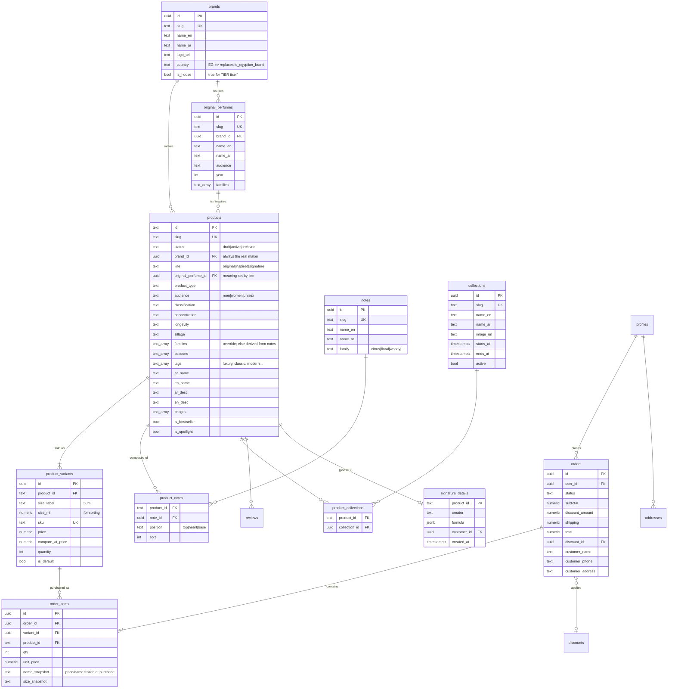

# TIBR — Catalog Data Model (proposed)

Status: **for review — not implemented.**
Supersedes the four overlapping category systems currently on `products`
(`category`, `perfume_type`, `listing_type`/`fragrance_category`/`sample_type`,
and the free-text `product_category` tag string).

---

## 1. ERD



---

## 2. The four axes, and why each lives where it does

| Concept | Home | Why |
|---|---|---|
| **Line** (original / inspired / signature) | column on `products`, required | Exactly one per product. Structural: `inspired` ⇒ must link an original; `signature` ⇒ has a formula. An enum can enforce that; a join table cannot. |
| **Collections** (Ramadan, Limited Edition…) | `collections` + `product_collections` | Many per product, campaign-lived, admin-created. Genuinely unbounded. |
| **Brand** | `brands` table, FK | Grows forever; has logo, country, house flag. |
| **Audience / Product type / Classification / Concentration / Season / Family** | constrained columns + `text[]` | Closed vocabularies. Adding a value requires nav copy, AR labels and filter UI anyway — a lookup table buys nothing but joins. |
| **Notes** | `notes` + `product_notes` | 500+ bilingual entries, each with a family. Unlocks *shop by note* and lets `families` be derived. |
| **Variants** | `product_variants` | Price, stock and SKU are per-size, not per-product. |

### Controlled vocabularies (CHECK-constrained)

| Field | Values |
|---|---|
| `line` | `original`, `inspired`, `signature` |
| `product_type` | `perfume`, `candle`, `air-freshener`, `set`, `sample`, `bakhoor` |
| `audience` | `men`, `women`, `unisex` |
| `classification` | `designer`, `niche`, `arabian`, `celebrity` |
| `concentration` | `parfum`, `edp`, `edt`, `edc`, `attar`, `mist` |
| `longevity` | `light`, `moderate`, `long`, `eternal` |
| `sillage` | `intimate`, `moderate`, `strong`, `enormous` |
| `families[]` | `floral`, `woody`, `oriental`, `fresh`, `citrus`, `gourmand`, `spicy`, `aquatic`, `leather`, `musk`, `oud` |
| `seasons[]` | `spring`, `summer`, `fall`, `winter` |
| `product_notes.position` | `top`, `heart`, `base` |

---

## 3. The `original_perfume_id` trick

One FK, two meanings, disambiguated by `line`:

| `line` | `original_perfume_id` means | Constraint |
|---|---|---|
| `original` | *this product **is** that original* (we stock the real Sauvage) | required |
| `inspired` | *this product is **inspired by** that original* | required |
| `signature` | — | must be NULL |

Payoffs from a single column:

- `WHERE original_perfume_id = X AND line = 'inspired'` → "our version of Sauvage"
- `WHERE original_perfume_id = X AND line = 'original'` → the real bottle
- Both sides of the same registry row cross-sell each other automatically.
- **"Inspired by Dior"** = `products ⋈ original_perfumes ⋈ brands WHERE line='inspired' AND brands.slug='dior'` — and the product's own `brand_id` stays TIBR, so `/brands/dior` never lists a dupe as a Dior product.

The registry is a **superset** of what we sell: an original can exist purely as a
reference target for an inspired product we make, without ever being stocked.

```sql
CHECK (line <> 'signature' OR original_perfume_id IS NULL)
CHECK (line <> 'inspired'  OR original_perfume_id IS NOT NULL)
```

---

## 4. Derived families

`families` is nullable. When empty, fall back to the notes:

```sql
CREATE VIEW product_families_effective AS
SELECT p.id,
       COALESCE(
         NULLIF(p.families, '{}'),
         (SELECT array_agg(DISTINCT n.family)
            FROM product_notes pn JOIN notes n ON n.id = pn.note_id
           WHERE pn.product_id = p.id)
       ) AS families
  FROM products p;
```

Automation by default, perfumer override when the note arithmetic is wrong.

---

## 5. Navigation = saved filters

No nav-specific columns. Every tab is a query over the axes; pretty routes are
presets that hydrate the same filter state as the query-param form.

| Route | Filter |
|---|---|
| `/shop/men` | `audience=men` |
| `/shop/inspired` | `line=inspired` |
| `/shop/arabian` | `classification=arabian` |
| `/shop/candles` | `product_type=candle` |
| `/shop/brands/dior` | `brand.slug=dior` |
| `/shop/inspired-by/dior` | `line=inspired` ⋈ `original.brand.slug=dior` |
| `/shop/notes/oud` | `product_notes ∋ oud` |
| `/shop/ramadan` | `collections ∋ ramadan` |
| `/shop?...` | any combination of the above |

This retires `listing_type`, `fragrance_category` and `sample_type` — all three
already dead (`AdminProduct.jsx:1227-1229` hard-codes them to `null`).

---

## 6. Columns retired from `products`

> **Verified against the live project, 2026-07-12.** The live `products` table is
> only: `id, category, sizes, image, ar_name, ar_desc, ar_price, en_name,
> en_desc, en_price, created_at, quantity, review_avg, review_count`.
>
> **Every migration from `20260704` onward was written but never applied.** So
> `brand`, `perfume_type`, `sub_category*`, `listing_type`, `fragrance_category`,
> `sample_type`, `product_category`, `perfume_classification`, `gender`,
> `season` and `is_egyptian_brand` **do not exist in the database at all** — they
> exist only in migration files and in `AdminProduct.jsx`'s form payload, which
> is why `server.js` carries `OPTIONAL_PRODUCT_COLUMNS` and `insertOrdersCompat`
> as shims. The `discounts` table does not exist either (see §10).
>
> **Consequence: there is no legacy taxonomy to migrate.** No heuristic backfill
> of tag strings, no `perfume_type` → `line` mapping. The destructive pass
> shrinks to the five columns below, and Step 5 stops being scary.

| Dropped | Replaced by |
|---|---|
| `category` | `product_type` |
| `sizes`, `quantity`, `ar_price`, `en_price` | `product_variants` |
| `image` (single) | `images[]` |

The phantom columns need no migration — only the removal of the dead fields
`AdminProduct.jsx:1224-1247` still sends (`listing_type`, `fragrance_category`,
`sample_type`, `product_category`, `season`, `perfume_classification`,
`is_egyptian_brand`), which the server silently discards today.

---

## 7. Open question: orders

`orders` today is **one row per cart line**, grouped by `checkout_reference`
(`server.js:493`). Each row redundantly carries `order_total`, `discount_amount`
and `discount_id`. There is no row that *is* the order.

Adding variants forces us into this table regardless (`variant_id` has to land
somewhere). Two options:

- **A — minimal:** add `variant_id` to `orders`, leave the shape alone. Cheap; keeps the redundancy and the missing order entity.
- **B — correct:** split into `orders` (one row, with status/subtotal/discount/total) + `order_items` (one row per line, with `variant_id` and price snapshots). Touches checkout, account order history, and the admin orders view.

**Recommendation: B**, done in the same operation. It is the same tables, the
same code paths, and the same testing pass — doing it later means migrating live
order history.

---

## 8. Cutover plan

Scale check: **3 products, 11 variants, 1 order.** Every "migration" below is
really a re-entry job that fits in an afternoon.

| Step | File | State |
|---|---|---|
| 0 | Export `products` + `orders` snapshot | — |
| 1 | `20260713000000_catalog_entities.sql` — the 7 entity tables, RLS, indexes, brand seed, variant backfill | **written, awaiting your run** |
| 2 | New columns on `products` (`line`, `audience`, `classification`, `brand_id`, `original_perfume_id`, `slug`, `status`, …) + `product_families_effective` view. **No legacy backfill needed** — set the 3 products by hand. | after step 1 validates |
| 3 | *(merged into step 1 — variants are already backfilled there)* | — |
| 4 | `orders` → `orders` + `order_items`, with `variant_id`. Option B (§7). 1 live order to migrate. | after step 2 |
| 5 | Drop `category`, `sizes`, `quantity`, `ar_price`, `en_price`, `image` | after the frontend cuts over |
| 6 | Extract `NOTES_CATALOG` from `AdminProduct.jsx` → `lib/notesCatalog.js`, seed the `notes` table from it; rewrite `shopNav.js` → `taxonomy.js` | with step 2 |

Steps 1–2 are additive and safe to ship while the current frontend runs. Step 5
is the point of no return.

Validate each step by running it wrapped in `BEGIN; … ROLLBACK;` in the Supabase
SQL editor first — step 1 ends with a PASS/FAIL validation block (§9 of that
file) that prints its own evidence.

---

## 10. Unrelated live bug found while validating

The **`discounts` table does not exist in the database.** The Shopify-parity
discounts feature (migration `20260711000000`, plus the admin panel from commit
`b42cf3e`) has no table behind it — its own migration header admits it was never
applied. The admin discounts panel cannot be working today.

Not caused by this work and not fixed by it. Decide separately whether to apply
that migration; if so, do it **after** step 4, since `orders` grows a proper
`order_items` table that the discount targeting should reference.

---

## 9. Deferred (designed for, not built)

- `signature_details` — 1:1 extension table on `products`. Adding it later requires **zero** changes to `products`.
- Community-voted longevity/sillage (currently admin-set).
- `collections` as a discount targeting mode — `discounts.applies_to` gains `specific_collections`, closing the gap its own migration comments call out (`20260711000000_add_discounts.sql:66-68`).
